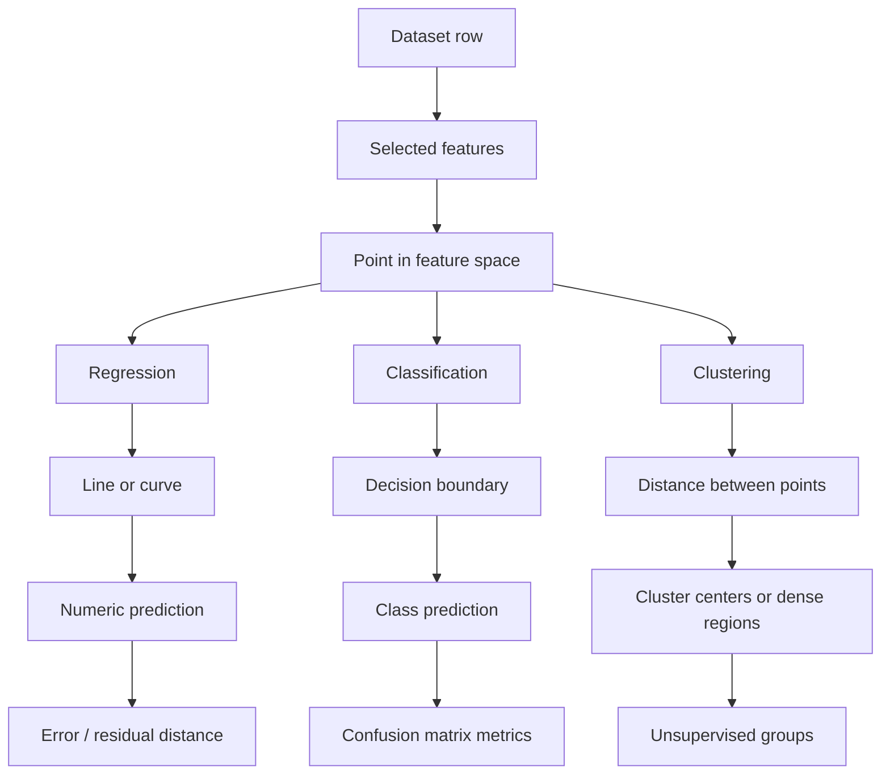

# Geometric Interpretation of the Machine Learning Models

This document explains the project from a geometric point of view.

The main idea is simple:

```text
data records -> points in a coordinate system
features -> axes / coordinates
models -> lines, curves, boundaries, margins, or groups
```

This does not replace the notebooks or the mathematical formulas. It adds a visual interpretation similar to coordinate geometry: the models work with points in a feature space.

The project remains educational and does not provide veterinary diagnosis.

---

## 1. Data as Points in a Coordinate System

A table row can be understood as a point.

If the selected features are:

| Axis | Feature |
|---|---|
| x-axis | `age_months` |
| y-axis | `weight_kg` |

then one row becomes a 2D point:

```text
point = (age_months, weight_kg)
```

Example:

```text
point = (4 months, 20 kg)
```

With more features, the same idea becomes a multi-dimensional feature space:

```text
x = (x1, x2, x3, ..., xn)
```

In machine learning, the model does not understand a dog directly. It understands the numeric representation of each record.

---

## 2. Regression as a Line in a Coordinate System

In the first regression notebook, the model learns a relationship between age and weight.

The simplest linear model is:

```text
y_hat = beta_0 + beta_1 * x
```

Geometrically:

- data records are points
- the model is a line
- the prediction is a point on that line
- the error is the vertical distance between the real point and the predicted point


### Residual as Distance

For one point:

```text
error = y - y_hat
```

This is the vertical difference between the actual value and the model prediction.

This is why regression metrics such as MAE, MSE, and RMSE are based on prediction errors.

---

## 3. Polynomial Regression as a Curve

A straight line is not always flexible enough.

Polynomial regression adds powers of the input feature:

```text
y_hat = beta_0 + beta_1*x + beta_2*x^2
```

Geometrically, this creates a curve instead of only a straight line.


This can be useful when growth does not follow a perfectly linear pattern.

---

## 4. Classification as a Decision Boundary

Classification does not predict a number. It predicts a class.

In this project, the classification notebook predicts:

```text
normal_growth
needs_attention
```

Using two features for visualization:

| Axis | Feature |
|---|---|
| x-axis | `visit_age_months` |
| y-axis | `weight_kg` |

Each record becomes a point in a 2D feature space.

The classifier tries to find a boundary between the classes.


### Geometric Meaning

| Model | Geometric interpretation |
|---|---|
| Logistic Regression | Learns a linear boundary based on probabilities |
| Decision Tree | Splits the space into rectangular decision regions |
| Random Forest | Combines many tree-based regions |
| AdaBoost | Combines weak decision boundaries into a stronger one |
| SVM | Searches for a boundary with a large margin |

---

## 5. SVM and Margin Geometry

Support Vector Machines are especially geometric.

The main idea is to find a separating boundary with the widest possible margin.

In two dimensions, the boundary can be imagined as a line.

In higher dimensions, it becomes a hyperplane.

A simple boundary can be written as:

```text
w^T * x + b = 0
```

The RBF kernel allows the model to create non-linear boundaries by comparing distances between points:

```text
K(x, x') = exp(-gamma * ||x - x'||^2)
```

This is why feature scaling is important before SVM: the meaning of distance depends on the scale of the axes.

---

## 6. Clustering as Groups of Nearby Points

Clustering will be the next course topic.

Unlike classification, clustering does not use a known target label.

Instead, it searches for structure in the feature space.

The basic idea is:

```text
nearby points -> same group
farther points -> different groups
```

For example, K-Means tries to find cluster centers and assign points to the nearest center.


This future topic will use distance and coordinate-space thinking even more directly.

---

## 7. Geometric Summary Table

| Course stage | Geometric object | Project example |
|---|---|---|
| Regression | line / curve | predict `weight_kg` from age and other features |
| Polynomial Regression | curved function | model non-linear growth trend |
| Regularization | smoother / constrained model | reduce overfitting by controlling coefficients |
| RANSAC | line fitted to inliers | reduce influence of outlier points |
| Classification | decision boundary | separate `normal_growth` from `needs_attention` |
| Decision Tree | rectangular regions | split feature space with yes/no rules |
| SVM | maximum-margin boundary | separate classes with margin-based geometry |
| Clustering | groups of nearby points | discover growth-pattern groups |

---

## 8. Feature Space Flow



---

## 9. Why This Matters

This geometric view helps explain why preprocessing matters.

| Step | Geometric reason |
|---|---|
| Feature selection | chooses the axes of the coordinate system |
| Encoding | converts categories into numeric coordinates |
| Scaling | makes distances more meaningful |
| Train/test split | checks whether learned geometry generalizes |
| Model comparison | compares different geometric assumptions |

The main lesson is that machine learning models are not magic. They learn mathematical structures inside a feature space.
