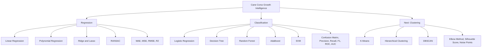
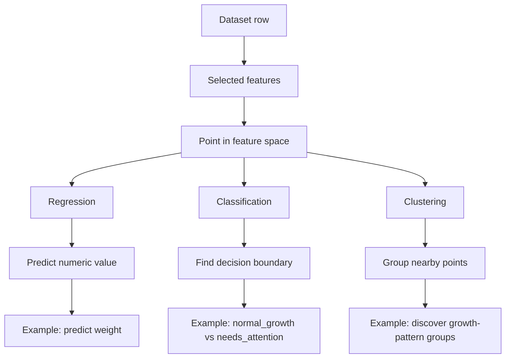

# Mathematical Foundation

This document explains the main mathematical ideas used in the project.

The goal is not to provide a full university-level proof of every algorithm. The goal is to show that the notebooks are not only code examples, but are based on mathematical models, loss functions, metrics, and decision rules.

The project remains an educational machine learning project. It does not provide veterinary diagnosis.


---

## Quick Mathematical Map

This project currently uses three main machine learning directions:



The diagram shows the project structure: regression predicts a number, classification predicts a known class, and clustering will discover unknown groups.

---

## Formula Reference Table

| Area | Formula | Meaning | Used in project |
|---|---|---|---|
| Simple Linear Regression | `y_hat = beta_0 + beta_1 * x` | Predicts one numeric value from one feature. | `01_linear_regression_growth_prediction.ipynb` |
| Multi-Dimensional Regression | `y_hat = beta_0 + beta_1*x_1 + ... + beta_n*x_n` | Predicts a numeric value using multiple features. | Regression notebook, multi-feature experiment |
| Matrix Regression Form | `y_hat = X * beta` | Compact way to write regression for many rows and features. | Regression explanation |
| Ordinary Least Squares | `min sum((y_i - y_hat_i)^2)` | Finds coefficients that minimize squared prediction errors. | Linear Regression baseline |
| Polynomial Regression | `y_hat = beta_0 + beta_1*x + beta_2*x^2` | Allows a curved relationship instead of only a straight line. | Polynomial Regression section |
| Ridge Regression | `min SSE + lambda * sum(beta_j^2)` | Adds L2 penalty to reduce large coefficients. | Ridge experiment |
| Lasso Regression | `min SSE + lambda * sum(abs(beta_j))` | Adds L1 penalty and can shrink weak coefficients close to zero. | Lasso experiment |
| RANSAC Inlier Rule | `abs(y_i - y_hat_i) <= threshold` | Treats points with small residuals as inliers and reduces outlier influence. | RANSAC robust regression |
| Logistic Regression Score | `z = beta_0 + beta_1*x_1 + ... + beta_n*x_n` | Linear score before converting to probability. | Classification notebook |
| Sigmoid Function | `p = 1 / (1 + e^(-z))` | Converts any score into a probability from 0 to 1. | Logistic Regression |
| Binary Decision Rule | `p >= 0.5 -> 1, otherwise -> 0` | Converts probability into a class label. | `growth_status_binary` prediction |
| SVM Boundary | `w^T * x + b = 0` | Separates classes with a decision boundary. | SVM classifier |
| RBF Kernel | `K(x, x') = exp(-gamma * ||x - x'||^2)` | Allows SVM to model non-linear class boundaries. | SVM with RBF kernel |
| K-Means Objective | `min sum(||x_i - mu_cluster(i)||^2)` | Groups points by minimizing distance to cluster centers. | Planned clustering notebook |

---

## Metrics Reference Table

| Metric | Formula | Best interpretation | Used in project |
|---|---|---|---|
| Error | `error_i = y_i - y_hat_i` | Difference between real and predicted value. | Regression evaluation |
| MAE | `(1 / n) * sum(abs(y_i - y_hat_i))` | Average absolute prediction error. Lower is better. | Regression comparison |
| MSE | `(1 / n) * sum((y_i - y_hat_i)^2)` | Average squared prediction error. Penalizes large errors. | Regression comparison |
| RMSE | `sqrt(MSE)` | Error in the same unit as the target, for example kg. Lower is better. | Regression comparison |
| R2 Score | `1 - SSE / SST` | How much target variation is explained by the model. Higher is better. | Regression comparison |
| Accuracy | `(TP + TN) / (TP + TN + FP + FN)` | Overall share of correct predictions. | Classification evaluation |
| Precision | `TP / (TP + FP)` | Of predicted positive cases, how many were correct. | `needs_attention` evaluation |
| Recall | `TP / (TP + FN)` | Of actual positive cases, how many the model found. | Important for `needs_attention` |
| F1-score | `2 * Precision * Recall / (Precision + Recall)` | Balance between precision and recall. Higher is better. | Classification comparison |
| True Positive Rate | `TP / (TP + FN)` | Same as recall. | ROC curve |
| False Positive Rate | `FP / (FP + TN)` | Share of normal cases incorrectly flagged as positive. | ROC curve |
| AUC | `Area under ROC curve` | Measures class separation across thresholds. Closer to 1 is better. | Classification comparison |
| Gini Impurity | `1 - sum(p_k^2)` | Measures how mixed a decision tree node is. Lower is purer. | Decision Tree |
| Entropy | `-sum(p_k * log2(p_k))` | Measures uncertainty in a node. Lower means less uncertainty. | Decision Tree |
| Information Gain | `impurity(parent) - weighted impurity(children)` | Measures how useful a split is. Higher is better. | Decision Tree |

---

## Project Formula Flow

| Course stage | Mathematical focus | Practical project output |
|---|---|---|
| Regression | Functions, coefficients, residuals, loss minimization | Predict and evaluate `weight_kg` |
| Regularization | Penalty terms added to the regression objective | Compare Ridge and Lasso with Linear Regression |
| Robust Regression | Inlier and outlier separation using residual thresholds | Compare RANSAC with normal regression |
| Classification | Probability, thresholding, class labels | Predict `normal_growth` vs `needs_attention` |
| Classification Evaluation | Confusion matrix and derived metrics | Compare Logistic Regression, Tree, Forest, AdaBoost, SVM |
| Clustering | Distances, cluster centers, density, separation | Planned discovery of growth-pattern groups |

These tables are intentionally concise. The detailed explanations below describe how each formula connects to the notebooks.

## 1. Regression

Regression predicts a numerical value.

In this project, the first regression task is to predict dog weight from age and other growth-related features.

### Simple Linear Regression

Simple linear regression uses one input feature:

```text
y = beta_0 + beta_1 * x
```

Where:

- `x` is the input feature, for example `age_months`
- `y` is the predicted value, for example `weight_kg`
- `beta_0` is the intercept
- `beta_1` is the coefficient for the feature

The model learns the best values of `beta_0` and `beta_1` from the training data.

### Multi-Dimensional Linear Regression

With multiple input features, the equation becomes:

```text
y = beta_0 + beta_1 * x_1 + beta_2 * x_2 + ... + beta_n * x_n
```

In matrix form:

```text
y_hat = X * beta
```

Where:

- `X` is the feature matrix
- `beta` is the vector of learned coefficients
- `y_hat` is the vector of predictions

In the project, multi-dimensional regression can use features such as age, height, sex, and activity level.

### Ordinary Least Squares

Ordinary Least Squares chooses coefficients that minimize the sum of squared errors:

```text
minimize sum((y_i - y_hat_i)^2)
```

In matrix notation:

```text
minimize || y - X * beta ||^2
```

This means the model tries to make the predicted values as close as possible to the real values.

### Polynomial Regression

Polynomial regression adds powers of a feature:

```text
y = beta_0 + beta_1 * x + beta_2 * x^2
```

This allows the prediction curve to bend instead of being only a straight line.

In this project, this is useful because dog growth is not always perfectly linear.

---

## 2. Regression Error Metrics

Regression metrics measure how far the predictions are from the real values.

### Error

For one prediction:

```text
error_i = y_i - y_hat_i
```

Where:

- `y_i` is the real value
- `y_hat_i` is the predicted value

### MAE - Mean Absolute Error

```text
MAE = (1 / n) * sum(|y_i - y_hat_i|)
```

MAE measures the average absolute error.

If MAE is 2.5, the model is wrong by about 2.5 kg on average.

### MSE - Mean Squared Error

```text
MSE = (1 / n) * sum((y_i - y_hat_i)^2)
```

MSE gives more weight to large errors because errors are squared.

### RMSE - Root Mean Squared Error

```text
RMSE = sqrt(MSE)
```

RMSE is easier to interpret than MSE because it is in the same unit as the target value.

For this project, RMSE is measured in kilograms.

### R2 Score

```text
R2 = 1 - (sum((y_i - y_hat_i)^2) / sum((y_i - mean(y))^2))
```

R2 measures how much of the variation in the target is explained by the model.

A higher R2 score usually means the model explains the target better.

---

## 3. Regularization

Regularization controls the model coefficients and helps reduce overfitting.

Overfitting happens when a model follows the training data too closely and performs worse on new data.

### Ridge Regression - L2 Regularization

Ridge Regression adds an L2 penalty:

```text
minimize sum((y_i - y_hat_i)^2) + lambda * sum(beta_j^2)
```

The penalty discourages very large coefficients.

### Lasso Regression - L1 Regularization

Lasso Regression adds an L1 penalty:

```text
minimize sum((y_i - y_hat_i)^2) + lambda * sum(|beta_j|)
```

Lasso can shrink some coefficients close to zero, which can act like feature selection.

### Main Idea

```text
larger penalty -> smaller coefficients -> simpler model
```

In the project, Ridge and Lasso are used to compare regularized regression models with ordinary linear regression.

---

## 4. RANSAC Robust Regression

RANSAC is useful when data may contain outliers.

A normal regression model can be influenced strongly by abnormal values.

RANSAC works by:

1. selecting random subsets of the data
2. fitting a model on each subset
3. checking which points are inliers
4. keeping the model that explains the largest group of inliers

A point is treated as an inlier when its error is below a selected residual threshold:

```text
|y_i - y_hat_i| <= threshold
```

In this project, RANSAC is used to show how robust regression can reduce the influence of an artificial outlier.

---

## 5. Classification

Classification predicts a class instead of a numerical value.

In this project, the classification target is:

```text
growth_status
```

Classes:

```text
normal_growth
needs_attention
```

Binary numeric target:

```text
0 = normal_growth
1 = needs_attention
```

The classification labels are educational labels based on body condition score information. They are not veterinary diagnosis.

---

## 6. Logistic Regression

Logistic Regression is a classification model, even though its name includes regression.

It first calculates a linear score:

```text
z = beta_0 + beta_1 * x_1 + beta_2 * x_2 + ... + beta_n * x_n
```

Then it applies the sigmoid function:

```text
p = 1 / (1 + e^(-z))
```

The sigmoid function converts any real number into a probability between 0 and 1.

### Decision Rule

```text
if p >= 0.5 -> class 1
if p < 0.5  -> class 0
```

In this project:

```text
class 0 = normal_growth
class 1 = needs_attention
```

The probability can also be used to understand how confident the model is.

---

## 7. Confusion Matrix

A confusion matrix compares predicted classes with actual classes.

For binary classification:

```text
TP = True Positive
TN = True Negative
FP = False Positive
FN = False Negative
```

In this project, the positive class is:

```text
needs_attention
```

So:

- `TP` means the model correctly predicted `needs_attention`
- `TN` means the model correctly predicted `normal_growth`
- `FP` means the model predicted `needs_attention`, but the actual class was `normal_growth`
- `FN` means the model predicted `normal_growth`, but the actual class was `needs_attention`

---

## 8. Classification Metrics

### Accuracy

```text
Accuracy = (TP + TN) / (TP + TN + FP + FN)
```

Accuracy shows the total percentage of correct predictions.

### Precision

```text
Precision = TP / (TP + FP)
```

Precision answers the question:

```text
When the model predicts needs_attention, how often is it correct?
```

### Recall

```text
Recall = TP / (TP + FN)
```

Recall answers the question:

```text
Of all actual needs_attention records, how many did the model find?
```

### F1-score

```text
F1 = 2 * Precision * Recall / (Precision + Recall)
```

F1-score combines precision and recall into one metric.

In this project, recall is important because missing a `needs_attention` record may be more problematic than flagging a normal record for review.

---

## 9. ROC Curve and AUC

The ROC curve evaluates a binary classifier at different thresholds.

It plots:

```text
True Positive Rate vs False Positive Rate
```

### True Positive Rate

```text
TPR = TP / (TP + FN)
```

This is the same as recall.

### False Positive Rate

```text
FPR = FP / (FP + TN)
```

### AUC

AUC means Area Under the Curve.

```text
AUC closer to 1 -> better separation between classes
AUC close to 0.5 -> close to random guessing
```

In the classification notebook, AUC helps compare Logistic Regression, Decision Tree, Random Forest, AdaBoost, and SVM.

---

## 10. Decision Trees

Decision Trees split the data step by step.

Each split asks a question such as:

```text
is weight_kg <= threshold?
```

The goal is to create leaves that contain mostly one class.

### Gini Impurity

```text
Gini = 1 - sum(p_k^2)
```

Where `p_k` is the proportion of class `k` in a node.

Lower Gini means the node is more pure.

### Entropy

```text
Entropy = - sum(p_k * log2(p_k))
```

Entropy measures uncertainty.

Lower entropy means less uncertainty.

### Information Gain

```text
Information Gain = impurity(parent) - weighted impurity(children)
```

The tree chooses splits that produce higher information gain.

In the project, the Decision Tree section also looks at feature importance.

---

## 11. Random Forest

Random Forest combines many decision trees.

Each tree is trained on a bootstrap sample of the data.

The final prediction is usually made by majority vote:

```text
final class = most common class predicted by the trees
```

Random Forest often reduces overfitting compared to a single decision tree because it averages many different trees.

---

## 12. AdaBoost

AdaBoost combines weak learners into a stronger model.

The idea is:

1. train a weak classifier
2. increase the importance of misclassified samples
3. train the next weak classifier with the updated weights
4. combine all weak classifiers

A simplified final classifier can be written as:

```text
H(x) = sign(alpha_1 * h_1(x) + alpha_2 * h_2(x) + ... + alpha_T * h_T(x))
```

Where:

- `h_t(x)` is a weak learner
- `alpha_t` is the learner weight
- `H(x)` is the final boosted classifier

In the project, AdaBoost is compared with Decision Tree and Random Forest.

---

## 13. Support Vector Machine

Support Vector Machine tries to find a decision boundary with the largest possible margin between classes.

For a linear SVM, the decision boundary is:

```text
w^T * x + b = 0
```

The margin is related to:

```text
2 / ||w||
```

The model tries to maximize this margin while controlling classification errors.

### C Parameter

`C` controls the penalty for misclassification.

```text
smaller C -> stronger regularization
larger C  -> model follows training data more closely
```

### RBF Kernel

The RBF kernel is:

```text
K(x, x') = exp(-gamma * ||x - x'||^2)
```

It helps SVM model non-linear class boundaries.

In the project, SVM is used as another classifier for comparison.

---

## 14. Planned Clustering Mathematics

The next planned topic is Unsupervised Learning and Clustering.

Clustering does not use a known target label.

Instead, it tries to discover groups in the data.

### K-Means Objective

K-Means tries to minimize the distance between data points and their assigned cluster centers:

```text
minimize sum(||x_i - mu_cluster(i)||^2)
```

Where:

- `x_i` is a data point
- `mu_cluster(i)` is the center of the assigned cluster

### Silhouette Score

Silhouette score compares:

```text
how close a point is to its own cluster
vs.
how close it is to the nearest other cluster
```

A higher silhouette score usually means better separated clusters.

### DBSCAN

DBSCAN finds dense regions in the data.

Important parameters:

```text
eps = neighborhood radius
min_samples = minimum number of points needed to form a dense region
```

DBSCAN can also mark some points as noise or outliers.

---

## 15. Project-Specific Interpretation Rule

The mathematical models in this project are used for learning and analysis.

They should not be interpreted as veterinary tools.

The correct interpretation is:

```text
The model output is an educational machine learning result.
It can support analysis, comparison, and experimentation.
It is not a medical or veterinary conclusion.
```

This rule applies to regression, classification, and future clustering experiments.

---

## Coordinate Systems and Feature Space

Machine learning models do not only work with tables. Internally, each row can be understood as a point in a coordinate system.

Each selected feature becomes one coordinate.

This is important because regression, classification, support vector machines, and clustering all use geometry in different ways.

### 2D Coordinate System

In the simplest regression experiment, the project uses two variables:

| Axis | Feature | Meaning |
|---|---|---|
| x-axis | `age_months` / `visit_age_months` | Dog age |
| y-axis | `weight_kg` | Dog bodyweight |

A single measurement can be represented as:

```text
point = (age_months, weight_kg)
```

Example:

```text
point = (4, 20)
```

This means that the dog measurement is located at 4 months on the x-axis and 20 kg on the y-axis.

This is why scatter plots are useful. They show how points are positioned in a coordinate system and whether there is a visible relationship between the variables.

### Multi-Dimensional Feature Space

When more than two features are used, the data is no longer only 2D.

A dataset row becomes a vector:

```text
x = (x1, x2, x3, ..., xn)
```

In the classification notebook, one record can be represented with features such as:

| Coordinate | Feature |
|---|---|
| x1 | `visit_age_months` |
| x2 | `weight_kg` |
| x3 | `average_adult_breed_weight_kg` |
| x4 | encoded `gender` |
| x5 | encoded `preventive_care_visit` |
| x6 | encoded `healthy_pet_diagnosis` |

So each dog growth record becomes one point in a multi-dimensional feature space.

The model does not understand the dog directly. It works with this numeric representation.

### Distance Between Points

Many machine learning methods use distance.

For two points in 2D:

```text
A = (x1, x2)
B = (y1, y2)
```

The Euclidean distance is:

```text
distance(A, B) = sqrt((x1 - y1)^2 + (x2 - y2)^2)
```

For more dimensions:

```text
distance(A, B) = sqrt((x1 - y1)^2 + (x2 - y2)^2 + ... + (xn - yn)^2)
```

This idea will be especially important in the next topic: **Unsupervised Learning and Clustering**.

### Decision Boundaries

Classification models try to separate classes in feature space.

In this project, the classes are:

```text
normal_growth
needs_attention
```

A classifier tries to find a boundary between these classes.

| Model | Coordinate-space interpretation |
|---|---|
| Logistic Regression | Finds a linear decision boundary |
| Decision Tree | Splits the feature space into rectangular regions |
| Random Forest | Combines many tree-based feature-space splits |
| AdaBoost | Combines weak decision boundaries into a stronger classifier |
| SVM | Finds a boundary with maximum margin |
| RBF SVM | Creates a non-linear boundary using the kernel trick |

### Clustering and Coordinates

Clustering does not use a target label.

Instead, it groups nearby points.

For the future clustering notebook, records may be grouped by features such as:

```text
visit_age_months
weight_kg
average_adult_breed_weight_kg
body condition information
```

The main idea is:

```text
points that are close to each other may belong to the same cluster
```

This is why scaling will be important. If one feature has much larger numeric values than another, it can dominate the distance calculation.

### Coordinate System Flow



### Project Interpretation

Coordinate systems help explain how dog growth records become mathematical objects.

The project starts with real-world observations, but the models operate on numeric features, vectors, distances, and decision boundaries.

That is why feature selection, scaling, encoding, and distance are important parts of the machine learning process.

These explanations are educational and do not turn the models into veterinary diagnostic tools.

---

## Geometric Interpretation Document

The formulas in this document are supported by a visual geometric explanation in:

```text
docs/geometric_interpretation.md
```

That document shows how the same ideas appear as coordinate systems, lines, curves, decision boundaries, margins, residual distances, and clusters in feature space.
